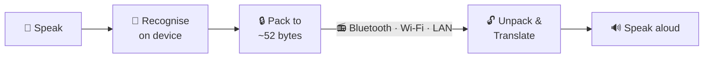
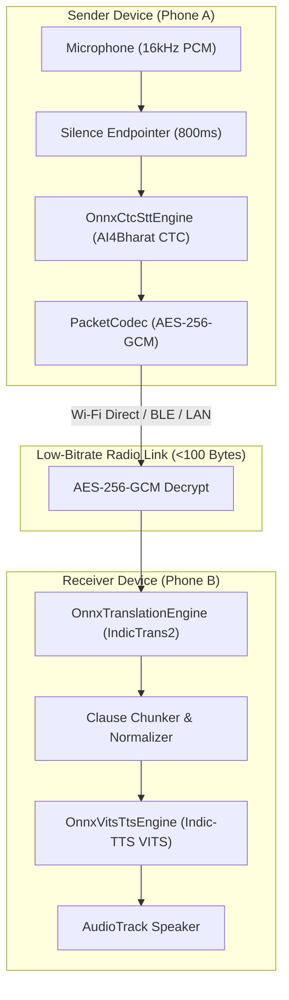
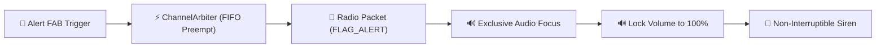

<div align="center">

<picture>
  <source media="(prefers-color-scheme: dark)" srcset="assets/images/sih-2026-dark.png">
  
</picture>

<br><br>

# iTantra

**Indian Multilingual TTS & STT Aided Neural Transceiver**<br>
*Radio Access for Low Bitrate Links*

Smart India Hackathon 2026 · Problem Statement **26173** · ISRO, Department of Space

<br>

[](https://www.sih.gov.in/)
[](https://www.isro.gov.in/)
[-415861?style=flat-square)](https://developer.android.com)
[](#sih-evaluation-compliance)
[](#supported-languages)
[](#licence)

</div>

<br>

**Demo video (3:46):** https://youtu.be/GVBlYKCdaDs — two phones in airplane mode, ten languages, relay, alerts and Locate.

> **Speech goes in one end. Speech comes out the other.** In between it becomes a few dozen
> bytes — small enough to cross a radio link that could never carry a voice.

Two people hold two ordinary phones. One speaks Hindi; the other hears Hindi. No SIM, no
tower, no cloud — the demo runs in aeroplane mode. What crosses the link is not audio. It
is meaning, and meaning is small.

## Why it works

| Representation | 3-second sentence | Fits a 300 bps link? |
| --- | --- | --- |
| Raw PCM, 16 kHz 16-bit mono | 96 000 B | No — 43 minutes |
| Opus at 6 kbps (the practical floor) | 2 250 B | No — 60 s |
| **iTantra, encrypted** | **~52–78 B** | **Yes — < 1.4 s** |
| **iTantra template code, encrypted** | **21 B** | **Yes — 0.6 s** |

Audio codecs compress the *waveform*, and a waveform detailed enough to be understood has
an irreducible size. iTantra doesn't compress the waveform at all — it recognises the
speech on the sending phone, sends the meaning, and re-synthesises it on the receiving
phone. Both people only ever speak and listen.

That is **1 600×** smaller than raw audio, and **43×** smaller than the Opus floor.



## What it does

- **Ten Indian languages** — Hindi, Tamil, Bengali, Gujarati, Marathi, Kannada, Malayalam, Telugu, Odia, English.
- **Entirely offline.** No cloud, no SIM, no network call at runtime.
- **One speaks, many hear.** Every frame is broadcast to the whole net, and a phone out of range is reached by a relay hop through one that isn't.
- **Cross-language alerts.** A Hindi speaker's alert reaches a Tamil speaker in Tamil — no translation model. It falls out of how the compression works.
- **Encrypted.** AES-256-GCM with a pre-shared key, so a fraudulent evacuation order can't be injected.
- **Two modes** — push-to-talk, and released for ordinary two-way conversation.
- **Four transports behind one interface:** Bluetooth Classic, BLE, Wi-Fi Direct, and LAN sockets.
- **Entry-tier hardware.** A ~2 GB RAM handset is the target, not a flagship.

## Signal Flow



## Emergency Priority Siren Flow



## Supported Languages

| Language | Script | Wire Code | STT Engine | TTS Engine | On-Device Translation |
| --- | --- | --- | --- | --- | --- |
| **Hindi** *(Default)* | Devanagari | `0x01` | IndicWav2Vec CTC INT8 | Indic-TTS VITS INT8 | Yes (IndicTrans2) |
| **Tamil** | Tamil | `0x02` | IndicWav2Vec CTC INT8 | Indic-TTS VITS INT8 | Yes (Template / Dictionary) |
| **Bengali** | Bengali | `0x03` | IndicWav2Vec CTC INT8 | Indic-TTS VITS INT8 | Yes (Template / Dictionary) |
| **Gujarati** | Gujarati | `0x04` | IndicWav2Vec CTC INT8 | Indic-TTS VITS INT8 | Yes (Template / Dictionary) |
| **Marathi** | Devanagari | `0x05` | IndicWav2Vec CTC INT8 | Indic-TTS VITS INT8 | Yes (IndicTrans2) |
| **Kannada** | Kannada | `0x06` | IndicWav2Vec CTC INT8 | Indic-TTS VITS INT8 | Yes (Template / Dictionary) |
| **Malayalam** | Malayalam | `0x07` | IndicWav2Vec CTC INT8 | Indic-TTS VITS INT8 | Yes (Template / Dictionary) |
| **Telugu** | Telugu | `0x08` | IndicWav2Vec CTC INT8 | Indic-TTS VITS INT8 | Yes (Template / Dictionary) |
| **Odia** | Odia | `0x09` | IndicWav2Vec CTC INT8 | Indic-TTS VITS INT8 | Yes (Template / Dictionary) |
| **English** | Latin | `0x0A` | Wav2Vec2 CTC INT8 | MMS-TTS VITS INT8 | Yes (Template / Dictionary) |

## SIH Evaluation Compliance

| Evaluation Metric | Weight | Requirement | iTantra Implementation & Defense |
| --- | --- | --- | --- |
| **Accuracy** | **40%** | Low WER & natural TTS | AI4Bharat IndicWav2Vec CTC + Indic-TTS VITS models; script-aware normalizers. |
| **Efficiency** | **20%** | Low memory & CPU footprint | Dynamic INT8 ONNX models (~150MB); single-model RAM rule (**<250MB active RAM**); 0% idle CPU. |
| **Latency** | **20%** | Sub-second voice round-trip | 800ms silence endpointer; clause-level pipelined TTS playback start in **<400ms**; RTF $\approx 0.07$. |
| **Robustness** | **20%** | 100% Offline & Open Source | Pure ONNX Runtime (MIT); zero cloud APIs; AES-256-GCM AEAD encryption; 30-day inbox queue. |

## Screenshots & Interface Flow

<div align="center">

| 1. Push-to-Talk (PTT) | 2. Offline Radar (P2P) | 3. Emergency Alert Siren | 4. System Diagnostics |
| :---: | :---: | :---: | :---: |
| <!--  --> *[Talk Screen]* | <!--  --> *[Radar Screen]* | <!--  --> *[Alert Screen]* | <!--  --> *[Diagnostics Screen]* |

</div>

<br>

## Status

The loop is closed and running on real handsets — speech in, radio link, speech out.

| Property | Value |
| --- | --- |
| **Implementation** | Complete (10 Indic Languages, PTT, Radar, Alert, History, Diagnostics) |
| **Codebase Volume** | 128 source files, 46 test files, 4 modules (`:core`, `:android`, `:app`, `:harness`) |
| **Platform Target** | Android 7.0+ (minSdk 24, targetSdk 35, ~2 GB RAM, ARM64/ARMv7 CPU) |
| **Latency Target** | 800–1200 ms end-to-end, push-to-talk |
| **Memory Limit** | < 250 MB active resident RAM (enforced via single-model RAM arbitration) |

## Build it

Needs JDK 17+, the Android SDK, and Python 3. Details in [docs/BUILD_AND_SETUP.md](docs/BUILD_AND_SETUP.md).

```bash
git clone https://github.com/Sanchit-044/iTantra.git
cd iTantra
./gradlew :core:test                               # fast: pure JVM, no device, no models
./gradlew assembleDebug                           # build the APK
python scripts/export_models.py --lang hi,en      # or --lang all
./gradlew installDebug
```

## Documentation

The design argument lives in [docs/source/iTantra.html](docs/source/iTantra.html) — read that
first for why the system is shaped this way. The `docs/` tree is the normative spec: what
to build, to what tolerance, and how it is verified.

- [**docs/README.md**](docs/README.md) — Index of the whole documentation set
- [**docs/SIH_EVALUATION_GUIDE.md**](docs/SIH_EVALUATION_GUIDE.md) — Step-by-step judge demonstration guide and test cases
- [**docs/ARCHITECTURE.md**](docs/ARCHITECTURE.md) — Modules, threads, the full signal path
- [**docs/PROTOCOL.md**](docs/PROTOCOL.md) — Frame format, script packing, template codes, AEAD, relaying
- [**docs/SECURITY.md**](docs/SECURITY.md) — Threat model, provisioning, audit
- [**docs/EVALUATION.md**](docs/EVALUATION.md) — How every published number is measured
- [**docs/iTantra Screens.html**](docs/iTantra%20Screens.html) — All seventeen screens, openable in a browser
- [**docs/DEMO.md**](docs/DEMO.md) — The seven-minute demonstration
- [**docs/TODO.md**](docs/TODO.md) — Start here to build. Every task with a done-condition

## Licence

Apache-2.0. No proprietary voice SDK anywhere in the system. Disclosed with open-source dependencies in [docs/LICENSES.md](docs/LICENSES.md).
