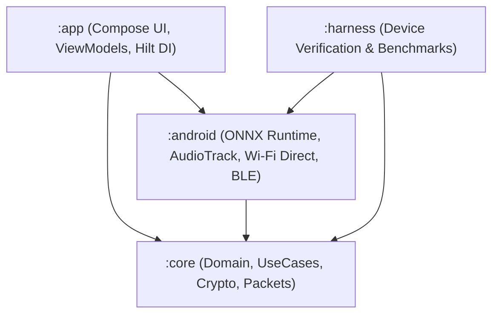
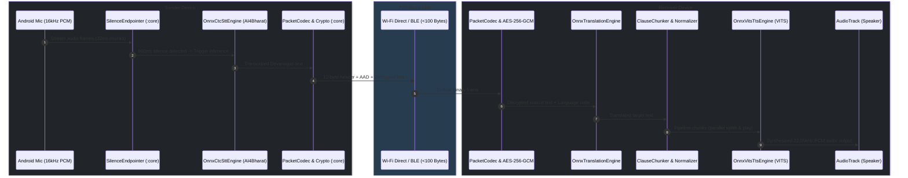
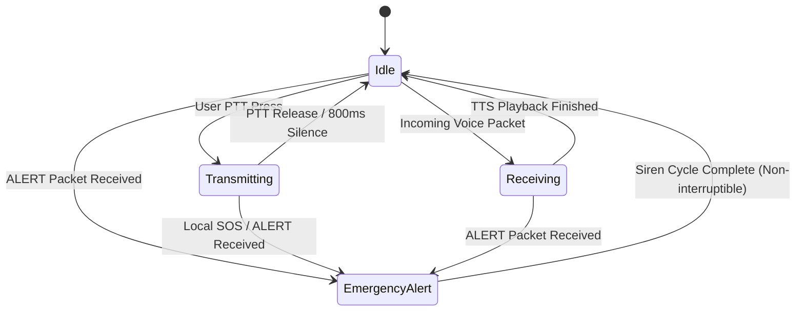

# System Architecture & Technical Specification

iTantra is designed following **Clean Architecture** principles with strict modular boundaries between pure Kotlin domain logic (`:core`), Android platform bindings (`:android`), and the Jetpack Compose user interface (`:app`).

---

## 1. Modular Hierarchy



### Module Responsibilities

| Module | Scope & Constraints | Key Components |
|---|---|---|
| **`:core`** | • **Pure Kotlin / JVM**<br>• Zero Android SDK dependencies<br>• 133+ automated unit tests | • `Language` enum & registry (10 Indic languages)<br>• `PacketCodec` & `CryptoEngine` (AES-256-GCM)<br>• `FloorController` & `ChannelArbiter`<br>• `SilenceEndpointer` & `WerCalculator`<br>• Use Cases (`StartPttTransmissionUseCase`, `ReceivePttTransmissionUseCase`, `SendAlertUseCase`)<br>• Normalizers & Lexicons |
| **`:android`** | • **Platform Bindings**<br>• Hardware I/O & Drivers | • `OnnxCtcSttEngine` (ONNX Runtime inference for STT)<br>• `OnnxVitsTtsEngine` (VITS synthesis for TTS)<br>• `WifiDirectTransport` & `BluetoothTransport`<br>• `AndroidAudioRecord` (16kHz PCM) & `AndroidAudioTrack`<br>• `AndroidAlertPlayer` (Forced alarm volume override)<br>• `AndroidKeystoreCryptoEngine` |
| **`:app`** | • **User Interface & State**<br>• Modern Jetpack Compose UI | • Screens: `MainScreen`, `TalkScreen`, `RadarScreen`, `AlertScreen`, `HistoryScreen`, `SettingsScreen`, `DiagnosticsScreen`<br>• `MainViewModel` (MVI state management)<br>• Hilt Dependency Injection modules |
| **`:harness`** | • **Automated Device Benchmarks**<br>• Headless Instrumented Testing | • `SttEvaluationTest` (WER scoring across datasets)<br>• `RoundTripTest` (Voice-to-voice latency verification) |

---

## 2. End-to-End Voice Transceiver Pipeline



---

## 3. Strict Resource Management & "One Model in RAM"

To operate reliably on **2GB RAM Android devices** without triggering Out-Of-Memory (OOM) errors, iTantra enforces strict memory lifecycle arbitration:

```text
[ Idle Standby ]
   │
   ├── User presses PTT ──► [ Unload TTS ] ──► [ Load STT (150MB) ] ──► [ Transcribe Speech ] ──► [ Unload STT ]
   │
   └── Packet Received  ──► [ Unload STT ] ──► [ Load TTS (150MB) ] ──► [ Synthesize Speech ] ──► [ Unload TTS ]
```

1. **Memory Budget Limit**: Resident RAM is strictly held below **250 MB**.
2. **CPU-Only Thread Pool**: ONNX Runtime sessions execute exclusively on CPU with tuned intra-op threads (`numThreads = min(4, availableCores)`), ensuring compatibility across all chipsets (Snapdragon, MediaTek, Unisoc).
3. **No Dynamic Memory Leaks**: Direct byte buffers and ONNX tensors are explicitly closed upon utterance completion.

---

## 4. Audio Arbitration & Emergency SOS Preemption



- **Priority Queueing**: Normal messages follow FIFO order; Emergency alert messages jump immediately to the **head of the queue**.
- **Audio Focus Escalation**: Standard messages acquire `AUDIOFOCUS_GAIN_TRANSIENT_MAY_DUCK`; Emergency alerts acquire `AUDIOFOCUS_GAIN_TRANSIENT_EXCLUSIVE` and programmatically pin device media stream volume to **100% max**.
