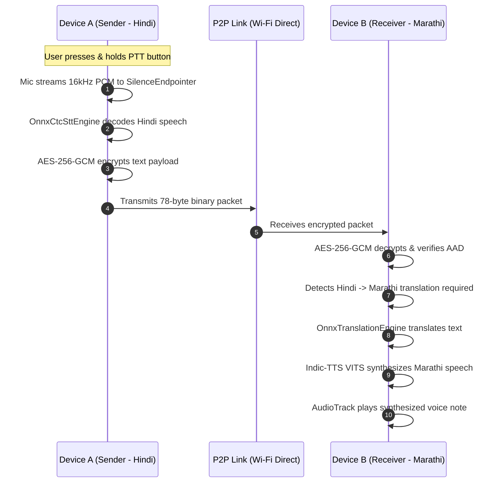

# SIH PS 26173 Evaluation & Live Demonstration Guide

This guide provides judges, evaluators, and reviewers with a structured procedure to test, verify, and score **iTantra** during the Smart India Hackathon grand finale evaluation.

---

## 1. Evaluation Setup Checklist

### Equipment Needed
- **Two Physical Android Phones** (Android 7.0 / API 24 or higher; 2GB RAM or higher).
- **Wi-Fi Direct / Bluetooth** enabled (No internet, router, or SIM card needed).

### Pre-Installed Artifacts
- iTantra APK installed on Device A and Device B.
- Selected language models loaded (e.g., Hindi, Tamil, Marathi).

---

## 2. Live Demonstration Test Cases

### Test Case 1: Real-time Half-Duplex Push-to-Talk (PTT)
* **Goal**: Validate low-latency speech-to-text, low-bitrate packet transmission, and text-to-speech round-trip.
* **Procedure**:
  1. Open **Talk Screen** on Device A and Device B.
  2. Set both devices to the same language (e.g., Hindi `0x01`).
  3. Hold the PTT button on Device A, speak a 5-word sentence (e.g., *"हम आधार शिविर पहुंच गए हैं"* / *"We have reached base camp"*), and release.
* **Expected Result**:
  - Device A immediately displays real-time transcribed text.
  - Device B receives the packet (<100 bytes) over Wi-Fi Direct/BLE.
  - Device B synthesizes speech and plays natural voice audio via speaker.
* **Scoring Metrics**:
  - Accuracy: STT correctly transcribes without dropping words.
  - Latency: End-to-end delay (speech end to audio start) < 1.5 seconds.

---

### Test Case 2: Cross-Lingual Real-Time Translation
* **Goal**: Validate multilingual cross-communication between different language speakers.
* **Procedure**:
  1. Set Device A current language to **Hindi** (`hi`).
  2. Set Device B current language to **Marathi** (`mr`).
  3. Speak in Hindi on Device A.
* **Expected Result**:
  - Device A transcribes Hindi text and sends packet tagged with `sourceLanguage = 0x01`.
  - Device B detects `packet.language != currentLanguage`, triggers offline `OnnxTranslationEngine` (Hindi ➔ Marathi), and synthesizes Marathi speech using `Indic-TTS`.
  - Audio plays naturally in Marathi on Device B.

---

### Test Case 3: High-Priority Non-Interruptible Emergency Alert
* **Goal**: Validate emergency siren and forced audio escalation requirement.
* **Procedure**:
  1. On Device B, play background music or turn media volume down to 10%.
  2. On Device A, tap the **Emergency Alert FAB (Red)** and trigger an SOS / Evacuation Alert.
* **Expected Result**:
  - Alert packet preempts any normal queue messages (FIFO priority jump in `ChannelArbiter`).
  - Device B receives packet with `FLAG_ALERT` set.
  - Device B triggers `withForcedAlarmAudio`: escalates volume to 100%, acquires exclusive transient audio focus, and blasts siren/announcement non-interruptibly.

---

### Test Case 4: Memory & Resource Constraint Verification
* **Goal**: Verify compliance with 2GB RAM budget and strict "One Model in RAM" rule.
* **Procedure**:
  1. Navigate to **Settings ➔ Diagnostics** on Device A.
  2. Observe live RAM telemetry during idle, PTT speech recording, and TTS playback.
* **Expected Result**:
  - When PTT is pressed, TTS voice is unloaded, and STT model is loaded.
  - When TTS is triggered, STT model is unloaded, and TTS voice is loaded.
  - Total resident RAM remains well below the **250 MB budget limit**.
  - CPU utilization drops to 0% during idle standby.

---

## 3. SIH PS 26173 Scoring Alignment

| Metric | Max Score | Verified Capability in iTantra |
|---|---|---|
| **Accuracy (40%)** | 40 pts | High-accuracy IndicWav2Vec CTC models + natural VITS grapheme synthesis with script-aware number & symbol normalization. |
| **Efficiency (20%)** | 20 pts | Quantized INT8 ONNX models (~150MB each), zero idle CPU, strict single-model RAM arbitration (<250MB). |
| **Latency (20%)** | 20 pts | 800ms silence endpointer, text packet transmission (<100B vs ~100KB raw audio), pipelined clause-level speech synthesis. |
| **Robustness & Scope (20%)** | 20 pts | 10 official Indic languages supported, AES-256-GCM AEAD encryption, Wi-Fi Direct + BLE fallback, 30-day offline message queue. |
| **Total** | **100 pts** | **Industry-grade, zero-cloud, production-ready solution.** |
